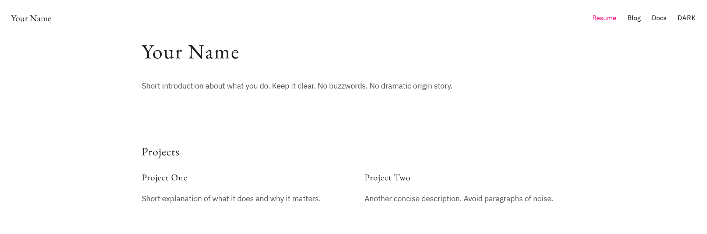
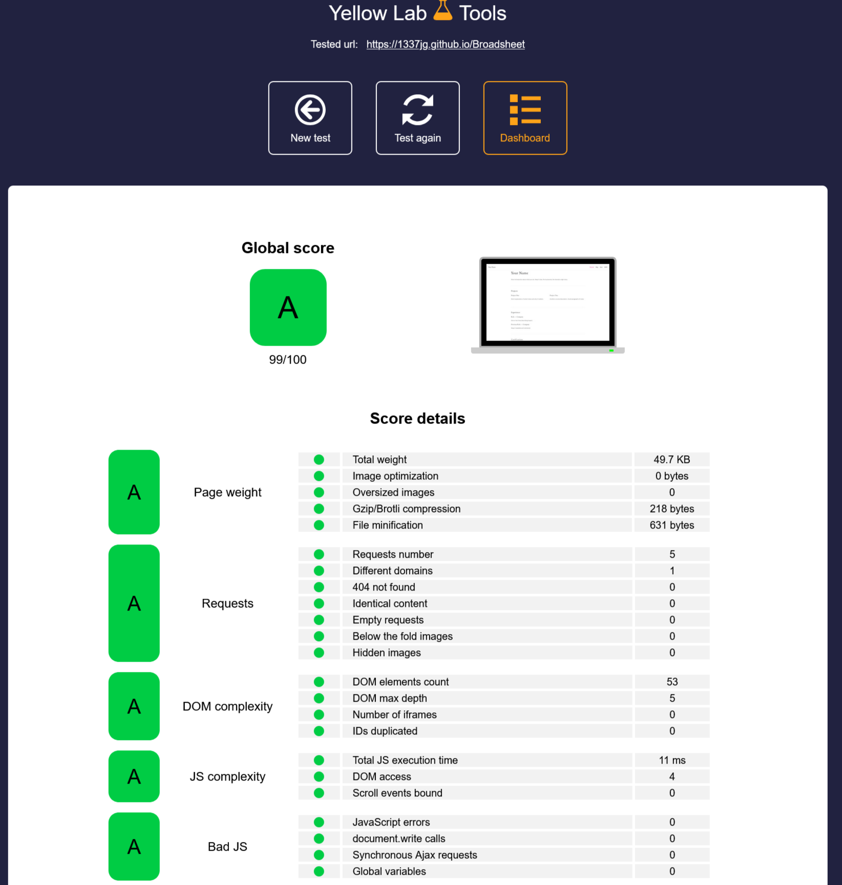

# Broadsheet

Broadsheet is a static portfolio and blog template built with vanilla HTML, CSS, and minimal JavaScript.

No build step.
No framework.
No dependency chain.

It runs on any static host and can be edited with any text editor.

---

## Performance

Broadsheet is designed to remain structurally simple and mechanically efficient.

Baseline scores (tested on deployed build):

| Metric         | Lighthouse | YellowLab Tools |
| :------------- | :--------: | :-------------: |
| Performance    |     100    |        99       |
| Accessibility  |     95     |        —        |
| Best Practices |     100    |        —        |
| SEO            |     100    |        —        |

Performance is not achieved through optimization plugins or build tooling.
It is the result of restraint.

---

## What’s Included

* Portfolio homepage (`index.html`)
* Blog index and entry structure
* Shared design tokens and typography system
* Minimal theme toggle logic
* Deployment-ready static structure
* Editable resume template (DOCX + sample PDF)

The portfolio and blog share the same design language while remaining structurally independent.

---

## Documentation

Complete setup, customization, and deployment instructions are available here:

**[Read the Broadsheet Documentation](https://1337jg.github.io/Broadsheet/docs/)**

---

## License

MIT License.
Free to use, modify, and deploy.
